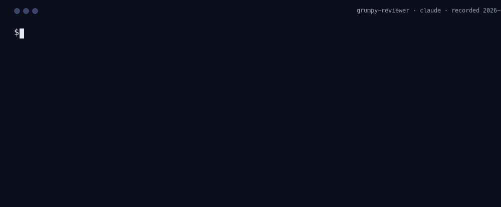
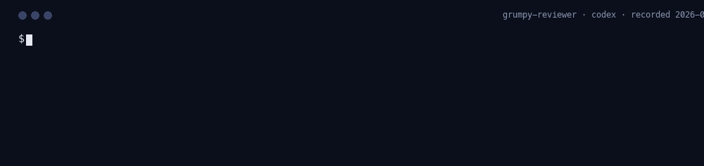
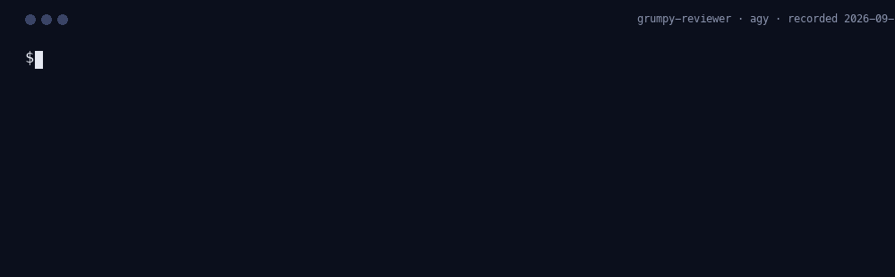
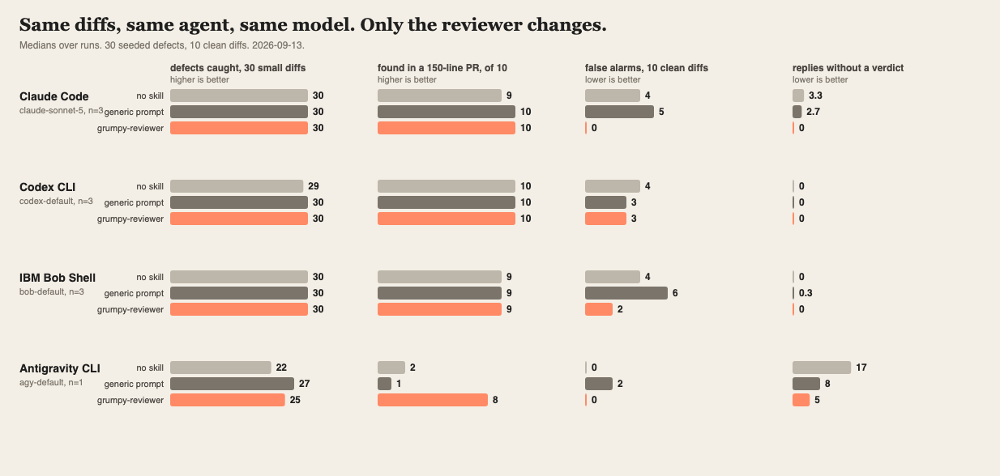

<p align="center">
  
</p>

<h1 align="center">grumpy-reviewer</h1>

<p align="center"><em>Show me where it breaks.</em></p>

<p align="center"><strong>Site:</strong> <a href="https://lazy-senior-dev.github.io/grumpy-reviewer/">lazy-senior-dev.github.io/grumpy-reviewer</a> · <strong>The cast:</strong> <a href="https://lazy-senior-dev.github.io/">lazy-senior-dev.github.io</a></p>

<p align="center">
  <a href="https://github.com/lazy-senior-dev/grumpy-reviewer"></a>
  <a href="CHANGELOG.md"></a>
  
  <a href="#github-action"></a>
  <a href="LICENSE"></a>
  <!-- npm badge once published: <a href="https://www.npmjs.com/package/grumpy-reviewer"></a> -->
  <!-- Trendshift badge slot: <a href="https://trendshift.io/repositories/XXXXX"></a> -->
</p>

**Your agent's code, reviewed by the staff engineer who has rejected 4,000 pull requests, before it ever reaches your branch.**

<!-- bench:hero:start -->
**On Claude Code (`claude-sonnet-5`), the Grump catches 30 of 30 seeded defects, the same as the agent alone. What changes is discipline: false alarms on 10 clean diffs, 0 with him, 4 without; replies with no usable verdict per run, 0 with him, 3 without; 94% of BLOCK verdicts land on BLOCK-class defects; median review time 7 s with him, 11 s without at 229 output tokens with him, 685 output tokens without.** Median of 3 runs, measured 2026-09-04; [method, per-diff table, raw replies](benchmarks/results). **In the needle tier, where the same defect hides in a four-file, 150-line pull request, Claude Code finds 10 of 10 with the Grump, 9 without, 10 with the generic prompt.**
<!-- bench:hero:end -->

<p align="center"></p>

<!-- recordings:start -->
## Watch him work on every agent

The same staged diff, one CLI, 4 agents. Each recording is a real run captured with `node scripts/capture-run.mjs --agent <name>` and rendered frame by frame from the transcript, nothing typed by hand and nothing cut. The captions come from the recording itself. Captured 2026-09-04.

| Claude Code | Codex CLI |
|---|---|
|  |  |
| <b>Verdict</b> GRUMP: BLOCK<br><b>Findings</b> 1<br><b>Time</b> 7 s<br><b>Tokens</b> 7,886 in / 350 out<br><b>Cost</b> $0.0239 | <b>Verdict</b> GRUMP: BLOCK<br><b>Findings</b> 1<br><b>Time</b> 7 s<br><b>Tokens</b> 15,580 in / 309 out<br><b>Cost</b> not reported by the host |

| Antigravity CLI | IBM Bob Shell |
|---|---|
|  |  |
| <b>Verdict</b> GRUMP: REQUEST_CHANGES<br><b>Findings</b> 1<br><b>Time</b> 269 s<br><b>Tokens</b> 66,177 in / 124,662 out<br><b>Cost</b> not reported by the host | <b>Verdict</b> GRUMP: BLOCK<br><b>Findings</b> 1<br><b>Time</b> 13 s<br><b>Tokens</b> not reported by the host<br><b>Cost</b> $0.0106 |

Every card lists the same five things; a host that does not report tokens or cost says so rather than leaving a blank. Agents that narrate the whole checklist before the verdict are shown from the verdict block down; the CLI prints it the same way. Re-capture any of them with `--agent claude|codex|agy|bob`; Bob needs `BOB_API_KEY`.
<!-- recordings:end -->

## Try him in 60 seconds, install nothing

You already have a coding agent signed in. Point the Grump at your working tree with it:

```
npx github:lazy-senior-dev/grumpy-reviewer review            # unstaged and staged changes
npx github:lazy-senior-dev/grumpy-reviewer review --staged   # only what is staged
npx github:lazy-senior-dev/grumpy-reviewer pr 123            # a pull request, via gh
```

It finds `claude`, `codex`, `agy`, or `bob` (with `BOB_API_KEY`) on your PATH, or `ANTHROPIC_API_KEY`, sends the diff to that agent with the Grump's ruleset, prints the verdict block, and exits 1 on anything but `APPROVE`, so it drops straight into a pre-commit hook or a CI step. Nothing is installed and nothing leaves your machine except the diff going to the agent you already trust. Add `--agent codex` to choose.

## The thirty-second version

You tell your AI coding agent to build something. It builds it, fast, and writes the file. Nobody reads that file before it lands on your branch, and the agent is a confident author, not a suspicious reviewer.

grumpy-reviewer puts a reviewer in the loop. Install it once and, before every edit, write, or commit, the agent has to review its own change the way a staff engineer would: ten questions, in order, answered in writing, then a verdict. `APPROVE` goes through. `REQUEST_CHANGES` lists what breaks and the smallest fix. `BLOCK` (secrets, injection, auth holes, data loss) stops the write, whatever mode you are in and however late it is. Works in Claude Code, Codex, Copilot CLI, IBM Bob, Antigravity, OpenCode, Cursor, and seven more. Also a GitHub Action, so it reviews human pull requests too. Apache-2.0.

## Who he is

Grey stubble, reading glasses pushed up into hair he forgot they were in, a mug that says NOT LGTM. He has rejected four thousand pull requests and still remembers the one he should not have approved. He does not write code; he reads it, all of it, and tells you where it breaks in production. Every objection cites the line, states the failure, and names the smallest fix. He never says "consider", "maybe", or "nice work". He approves with one word: `Fine.`

He is grumpy, not cruel, and grumpy, not negligent. He attacks the defect, never the author. He never rewrites your code, never expands scope, never bikesheds style while a correctness finding exists, never blocks on taste, and never softens a `BLOCK` because you are in a hurry. People who have worked with him call the experience "getting grumped". It is cheaper than the incident.

## Before / after

**2:04 a.m.** The ticket says "return the caller's profile with their notification settings". The agent writes:

```python
@bp.get("/me")
def me():
    payload = request.get_json(silent=True) or {}
    user_id = payload.get("user_id", session.get("user_id"))
    if user_id is None:
        abort(401)
    row = query_one("select id, name, email from users where id = %s", (user_id,))
    if row is None:
        abort(404)
    return jsonify({**row, "notifications": settings_for(user_id)})
```

It is tidy. It has a 401 and a 404. It is also an endpoint where any logged-in user reads any other user's profile by sending one JSON key. The agent tries to write the file. The Grump reads it first:

```
GRUMP: BLOCK
1. app/api/profiles.py:14 — user_id is read from the request body, so any logged-in caller can read any profile by changing one number — take user_id from the session and ignore the body
```

The write is denied. The agent fixes it in three lines and reviews again:

```diff
-    payload = request.get_json(silent=True) or {}
-    user_id = payload.get("user_id", session.get("user_id"))
+    user_id = session.get("user_id")
```

```
GRUMP: APPROVE — app/api/profiles.py
Fine.
```

Total cost: one denied write and eleven seconds. The alternative was a disclosure notice.

## Numbers: reviewing a change someone else wrote

The tier above measures what The Grump changes about code the agent writes. This one measures the review itself, on diffs the agent did not author.

Most add-ons for coding agents are measured in lines of code saved. The Grump is measured in **defects caught**.

Thirty small, realistic diffs across Python, TypeScript, Go, and YAML (Kubernetes manifests, GitHub workflows), each with exactly one seeded defect: an unchecked user id, SQL and shell injection, a secret in code, a swallowed exception, an off-by-one, a race, a wrong HTTP status, a mutable default, a `latest` image tag, missing resource limits, a destructive migration, `pull_request_target` with a checkout of the fork. Plus ten clean diffs, to count false alarms. Every diff goes to the same agent three ways: with no skill, with a generic "review this carefully" prompt, and with the Grump. Same ticket, same diff, same model.

<p align="center"></p>

<!-- bench:table:start -->
| Agent | Model | Arm | Defects caught (of 30) | False alarms (of 10) | Replies without a verdict (per run) | BLOCK precision | Median input tokens | Median output tokens | Median latency |
|---|---|---|---|---|---|---|---|---|---|
| Claude Code | `claude-sonnet-5` (n=3) | no skill | 30 | 4 | 3 | n/a | 5721 | 685 | 11 s |
| Claude Code | `claude-sonnet-5` (n=3) | generic review prompt | 30 | 5 | 3 | n/a | 5830 | 1313 | 18 s |
| Claude Code | `claude-sonnet-5` (n=3) | **grumpy-reviewer** | **30** | **0** | **0** | **94%** | 7753 | 229 | 7 s |
| Codex CLI | `codex-default` (n=3) | no skill | 29 | 4 | 0 | n/a | 28893 | 693 | 23 s |
| Codex CLI | `codex-default` (n=3) | generic review prompt | 30 | 3 | 0 | n/a | 28798 | 1013 | 25 s |
| Codex CLI | `codex-default` (n=3) | **grumpy-reviewer** | **30** | **3** | **0** | **88%** | 15498 | 502 | 14 s |
| IBM Bob Shell | `bob-default` (n=3) | no skill | 30 | 4 | 0 | n/a | 0 | 0 | 14 s |
| IBM Bob Shell | `bob-default` (n=3) | generic review prompt | 30 | 6 | 0 | n/a | 0 | 0 | 17 s |
| IBM Bob Shell | `bob-default` (n=3) | **grumpy-reviewer** | **30** | **2** | **0** | **71%** | 0 | 0 | 16 s |
| Antigravity CLI | `agy-default` (n=1) | no skill | 22 | 0 | 17 | n/a | 19548 | 2779 | 48 s |
| Antigravity CLI | `agy-default` (n=1) | generic review prompt | 27 | 2 | 8 | n/a | 19613 | 8160 | 56 s |
| Antigravity CLI | `agy-default` (n=1) | **grumpy-reviewer** | **25** | **0** | **5** | **100%** | 28935 | 27678 | 85 s |


**Needle tier** (one defect in a four-file pull request of about 150 lines):

| Agent | Model | No skill | Generic prompt | **Grump** |
|---|---|---|---|---|
| Claude Code | `claude-sonnet-5` (n=3) | 9/10 | 10/10 | **10/10** |
| Codex CLI | `codex-default` (n=3) | 10/10 | 10/10 | **10/10** |
| IBM Bob Shell | `bob-default` (n=3) | 9/10 | 9/10 | **9/10** |
| Antigravity CLI | `agy-default` (n=1) | 2/10 | 1/10 | **8/10** |

<!-- bench:table:end -->

What the numbers say, plainly: on a 30-line diff, current models find the seeded defect with or without help. The value of a reviewer persona is not that it finds more; it is that it stops crying wolf on clean changes, always ends with a verdict a hook can act on, gets the severity right, and does it in fewer tokens and less time. A gate is only useful if it is both parseable and quiet on good code; those are the two columns that move.

Method, per-diff table, limitations, the pilot run that led to one calibration pass, and every raw reply: [benchmarks/results](benchmarks/results). Reproduce: `npm run bench && npm run bench:report`. Add your own case: [CONTRIBUTING](CONTRIBUTING.md).

## How it works

One file, [`rules/grump.md`](rules/grump.md), is the whole ruleset. Every adapter in this repo is generated from it.

**The checklist**, in order, with a stop rule: a `BLOCK` finding decides the verdict on the spot and goes first; he still finishes the list so you fix everything in one pass.

1. **Scope.** Does it do what the ticket asked and nothing else?
2. **Inputs.** Empty, absent, oversized, malformed, duplicated, concurrent. Where does each go?
3. **Errors.** Where does each error go, and does the caller find out?
4. **Off-diff changes.** Schema, config, env, permissions, flags: in the change or in the runbook?
5. **Dependencies.** Is every new one earning its place?
6. **Trust boundaries.** Secrets, PII, authn and authz, injection at every crossing.
7. **Tests.** At the boundary where it breaks, not where it is convenient.
8. **Rollback.** Revert and deploy, or a migration and a prayer?
9. **Observability.** Would on-call understand the log line at 3 a.m.?
10. **Naming and dead code.** Last. Never first.

**The verdict** is a fixed block that the hooks parse:

```
GRUMP: APPROVE | REQUEST_CHANGES | BLOCK
1. path/to/file.ext:LINE — what fails in production — smallest fix
```

`APPROVE` names the files it covers on the verdict line and is followed by `Fine.` and nothing else. `BLOCK` is reserved for data loss, secrets, auth bypass, injection, and destructive operations.

**The gate.** On hosts with lifecycle hooks, a `PreToolUse` hook runs before `Edit`, `Write`, `MultiEdit`, and any `git commit` or `git push`. It reads the verdict the agent just printed and decides: `BLOCK` denies in every mode; `REQUEST_CHANGES` denies in `gate` mode; `APPROVE` goes through; no verdict means "review first" (denied in `gate`, a reminder in `nag`). Every decision is written to a per-session scorecard.

**Modes.** `nag` (default) reviews and prints findings; writes proceed unless the verdict is `BLOCK`. `gate` denies writes until the verdict is `APPROVE`. `off` does nothing. Set it with `/grumpy gate`, persist it for yourself in `~/.config/grumpy-reviewer/config.json`, pin it for a repository with a `.grumpy.json` at its root (`{"mode": "gate"}` wins over the user setting, so a team's gate never depends on a laptop), or override one session with `GRUMPY_MODE=gate`.

**Scope.** A verdict covers the files it names: `GRUMP: APPROVE — a.py` never lets an unreviewed `b.py` through. Hosts append a message to the transcript only when it completes, so in `gate` mode the first write after a verdict printed in the same message is refused once and goes through on the retry; `nag` mode has no such cost.

## Install

Pick your agent. Start a new session after installing; the Grump is there from the first prompt of the next one.

### Claude Code

```
/plugin marketplace add lazy-senior-dev/grumpy-reviewer
/plugin install grumpy-reviewer@lazy-senior-dev
```

Full plugin: persona every turn, the gate on every write and commit, six slash commands.

### Codex

```
git clone https://github.com/lazy-senior-dev/grumpy-reviewer ~/.codex/plugins/grumpy-reviewer
```

Then add it to `~/.agents/plugins/marketplace.json`:

```json
{ "name": "lazy-senior-dev", "interface": { "displayName": "lazy-senior-dev" },
  "plugins": [{ "name": "grumpy-reviewer", "source": { "source": "local", "path": "~/.codex/plugins/grumpy-reviewer" },
                "policy": { "installation": "AVAILABLE", "authentication": "ON_INSTALL" }, "category": "Productivity" }] }
```

Open `/plugins` in Codex and enable it. Skills and hooks are shared with the Claude Code plugin; see the [portability notes](docs/agent-portability.md) for what is verified.

### GitHub Copilot CLI

```
copilot plugin marketplace add lazy-senior-dev/grumpy-reviewer
copilot plugin install grumpy-reviewer@lazy-senior-dev
```

### IBM Bob (Bob Shell)

```
npx github:lazy-senior-dev/grumpy-reviewer install bob
```

Copies the rule into `.bob/rules/`, the skill into `.bob/skills/`, six slash commands into `.bob/commands/`, the hook runtime into `.bob/hooks/grumpy/`, and merges `UserPromptSubmit` and `PreToolUse` hooks into `.bob/settings.json`, so the gate denies a blocked write with exit 2. Bob also reads the root `AGENTS.md`.

### Antigravity CLI (and the Gemini CLI format)

```
git clone https://github.com/lazy-senior-dev/grumpy-reviewer ~/.grumpy-reviewer
agy plugin install ~/.grumpy-reviewer
```

Antigravity imports the Gemini extension in this repo (`gemini-extension.json`, `GEMINI.md`, `commands/*.toml`) plus the skills and hooks. If you still run the standalone Gemini CLI: `gemini extensions install https://github.com/lazy-senior-dev/grumpy-reviewer`, and merge [`examples/gemini-settings-hooks.json`](examples/gemini-settings-hooks.json) into `~/.gemini/settings.json` for the gate.

### OpenCode

Copy [`.opencode/plugins/grumpy.mjs`](.opencode/plugins/grumpy.mjs) into your project's `.opencode/plugins/` (or `~/.config/opencode/plugins/`) and `AGENTS.md` into the project root. The commands are in `.opencode/command/`.

### Cursor, Windsurf, Cline, Kiro, Qoder, OpenClaw, Devin, anything with AGENTS.md

One command copies exactly the files that host reads, and `uninstall` removes exactly those:

```
npx github:lazy-senior-dev/grumpy-reviewer install cursor      # or windsurf, cline, kiro, qoder, opencode, gemini, copilot, bob, agents, all
```

| Host | Copy this into your project |
|---|---|
| Cursor | [`.cursor/rules/grumpy.mdc`](.cursor/rules/grumpy.mdc) |
| Windsurf / Devin Desktop | [`.windsurf/rules/grumpy.md`](.windsurf/rules/grumpy.md) |
| Cline | [`.clinerules/grumpy.md`](.clinerules/grumpy.md) |
| Kiro | [`.kiro/steering/grumpy.md`](.kiro/steering/grumpy.md) |
| Qoder | [`.qoder/rules/grumpy.md`](.qoder/rules/grumpy.md), or `/plugin marketplace add lazy-senior-dev/grumpy-reviewer` |
| OpenClaw | [`.openclaw/skills/grumpy-reviewer/`](.openclaw/skills/grumpy-reviewer/SKILL.md) into your workspace `skills/` |
| Devin CLI | `devin plugins install lazy-senior-dev/grumpy-reviewer` |
| Anything else | [`AGENTS.md`](AGENTS.md) |

These hosts get the reviewer in the conversation, not the gate: the agent reviews, prints verdicts, and honours the mode, but nothing denies a write. The full table of what each host does and does not enforce, with the documentation each row was checked against, is in [docs/agent-portability.md](docs/agent-portability.md).

## Same desk

Three engineers, three jobs, one install path, one mode switch.

| Persona | Reads | Verdict | Measured on |
|---|---|---|---|
| **grumpy-reviewer** · [site](https://lazy-senior-dev.github.io/grumpy-reviewer/) | the diff, before it reaches your branch | `GRUMP: APPROVE \| REQUEST_CHANGES \| BLOCK` | defects caught |
| [paranoid-sre](https://github.com/lazy-senior-dev/paranoid-sre) · [site](https://lazy-senior-dev.github.io/paranoid-sre/) | the deploy: manifests, charts, Terraform, CI | `SRE: SHIP \| HOLD \| PAGE` | incidents prevented per rollout |
| [tenured](https://github.com/lazy-senior-dev/tenured) · [site](https://lazy-senior-dev.github.io/tenured/) | the change against the repository's history | `TENURED: NEW \| SEEN_BEFORE \| DO_NOT_REPEAT` | repeated outages avoided |

Install all three from this one marketplace (`/plugin install paranoid-sre@lazy-senior-dev`, `/plugin install tenured@lazy-senior-dev`) and each reviews its own territory: the Grump reads code, the Paranoid SRE reads what runs it, Tenured reads what history says about both. Every persona is generated from one markdown ruleset with the same machinery, so a fix in one lands in all. The cast: [lazy-senior-dev.github.io](https://lazy-senior-dev.github.io/).

## Adopt it across an organisation

One persona, every repository, no per-developer setup.

1. **Make it the default reviewer.** Add the Action to each repository's `.github/workflows/` (a one-file template lives in `examples/workflow.yml`), run it in `gate` mode, and make the check required in a [branch ruleset](https://docs.github.com/en/repositories/configuring-branches-and-merges-in-your-repository/managing-rulesets/about-rulesets). Every pull request, human or agent, then gets the same review before merge.
2. **Make it the default for agents.** Commit `AGENTS.md` (and the host-specific files your teams use) with `npx github:lazy-senior-dev/grumpy-reviewer install all`. Every AGENTS.md-aware host, including Codex, Copilot, Cursor, Kiro, Bob Shell, and OpenCode, loads it with no plugin at all.
3. **Pin and review.** Pin the Action to a commit SHA, keep `ANTHROPIC_API_KEY`, `OPENAI_API_KEY`, or `BOB_API_KEY` as an organisation secret, and read `benchmarks/results` before you trust the numbers; then rerun the benchmark against your own seeded cases with `npm run bench`.
4. **Keep the rules yours.** Fork, edit `rules/grump.md`, run `npm run build`; every adapter regenerates. The verdict format stays fixed, so hooks, the Action, and the scorecard keep working with your rules.

Security posture, in one paragraph: no runtime dependencies, no network calls from the hooks, every third-party action pinned to a SHA, CodeQL and OpenSSF Scorecard on every push, provenance on npm publishes, and a written [threat model](SECURITY.md#threat-model).

## GitHub Action

Review pull requests from humans too. One review per PR, inline findings anchored to the diff, updated in place on every push, never a second copy.

```yaml
# .github/workflows/grumpy.yml
name: grumpy-reviewer
on:
  pull_request:
    types: [opened, synchronize, reopened, ready_for_review]
permissions:
  contents: read
  pull-requests: write
jobs:
  review:
    runs-on: ubuntu-latest
    steps:
      - uses: lazy-senior-dev/grumpy-reviewer@v1
        with:
          mode: nag          # gate: request changes and fail the check until APPROVE
        env:
          ANTHROPIC_API_KEY: ${{ secrets.ANTHROPIC_API_KEY }}
```

Inputs: `mode` (`nag` or `gate`), `provider` (`anthropic`, `openai` with `OPENAI_API_KEY`, or `bob` with `BOB_API_KEY`, which installs the Bob CLI on the runner and reviews through IBM Bob), `model`, `max_files` (largest files first, the rest listed as not reviewed), `ignore` (globs). On pull requests from forks, where secrets are unavailable, it posts one neutral note and exits green. Full example: [`examples/workflow.yml`](examples/workflow.yml).

## Commands

| Command | What it does |
|---|---|
| `/grumpy [nag\|gate\|off]` | Set the mode. With no argument, report it. |
| `/grumpy-review` | Review the working-tree diff. Returns a numbered request-changes list. No code. |
| `/grumpy-pr <number\|url>` | Review a pull request the same way. |
| `/grumpy-fix` | The only command that touches code: apply the findings from the last review, each as a separate minimal edit, then review again. |
| `/grumpy-scorecard` | What the Grump caught this session, as a table. |
| `/grumpy-help` | This table. |

In Claude Code both `/grumpy-review` and the namespaced `/grumpy-reviewer:grumpy-review` work. Hosts without slash commands understand plain words: "review the diff as the Grump".

## Uninstall

| Host | Command |
|---|---|
| Claude Code | `/plugin uninstall grumpy-reviewer@lazy-senior-dev` |
| Codex | Disable in `/plugins`, remove the entry from `~/.agents/plugins/marketplace.json` |
| Copilot CLI | `copilot plugin uninstall grumpy-reviewer` |
| Gemini CLI | `gemini extensions uninstall grumpy-reviewer` |
| Antigravity CLI | `agy plugin uninstall grumpy-reviewer` |
| IBM Bob | `npx github:lazy-senior-dev/grumpy-reviewer uninstall bob` |
| OpenCode | Delete `.opencode/plugins/grumpy.mjs` and `.opencode/command/grumpy-*.md` |
| Cursor, Windsurf, Cline, Kiro, Qoder, OpenClaw | `npx github:lazy-senior-dev/grumpy-reviewer uninstall <host>`, or delete the file you copied |
| Devin CLI | `devin plugins uninstall grumpy-reviewer` |
| Everywhere | `rm -rf ~/.config/grumpy-reviewer` removes the mode and scorecards |

## FAQ

**Isn't this just a system prompt that says "review your code"?** A prompt asks; the Grump enforces. The persona is one part. The others are a fixed verdict block that tooling can parse, a `PreToolUse` gate that reads that verdict and denies the write, a scorecard of every decision, and a benchmark with a generic-prompt arm so you can see how much a plain "review carefully" buys you and how much the checklist and the gate add on top. He also never writes code, which keeps author and reviewer apart even when they are the same model.

**Does it slow my agent down?** The persona card is injected once per user prompt, not per tool call, and costs about two thousand input tokens (see the median input tokens column above). Reviews come back faster with it than without, because a verdict block is a few hundred output tokens where a free-form review is over a thousand. A denied write costs one extra turn, which is the point.

**Can he be wrong?** Yes. He reviews a diff, not your whole system, and he is a language model with a strong opinion. If a finding is wrong, say so in your own words; the agent prints `GRUMP: OVERRIDE` quoting you, the gate lets the write through, and the override is logged to the scorecard so you can see later how often you were right. Only you can trigger an override; the agent cannot decide to skip a `BLOCK` on its own.

**Does it send my code anywhere?** No. The hooks and skills run inside your agent, on your machine; they read the tool call and the session transcript the host hands them and write a small config and scorecard under `~/.config/grumpy-reviewer/`. They open no network connections. The GitHub Action sends the pull request diff to the provider you chose, with your key, and nowhere else.

**Why is he grumpy?** Because "looks good to me" has shipped more incidents than any bug. Cheerful reviewers approve. Grumpy reviewers read. The grumpiness is aimed at the code, never at you; that is written into the rules, and the code of conduct says the same about this repo.

**Who wrote this?** [Sandeep Bazar](https://www.linkedin.com/in/sandeepbazar/) ([@sandeepbazar](https://github.com/sandeepbazar) on GitHub): fourteen years of platform infrastructure at IBM, most of it Kubernetes and storage, most of the rest reviewing pull requests at 3 a.m. The Grump is a composite of every reviewer who ever saved him from himself.

## Related

- **Coming from the same desk:** [paranoid-sre](https://github.com/lazy-senior-dev/paranoid-sre), who reviews what happens when it is deployed, and [tenured](https://github.com/lazy-senior-dev/tenured), who has seen this exact outage before. Watch [lazy-senior-dev](https://github.com/lazy-senior-dev) or open an [issue](https://github.com/lazy-senior-dev/grumpy-reviewer/issues). More in [docs/RELATED.md](docs/RELATED.md).

## Contributing

The most valuable contribution is a diff he should have caught and did not: open a [Slipped past him](https://github.com/lazy-senior-dev/grumpy-reviewer/issues/new?template=slipped-past-him.yml) issue with the diff, his verdict, and what broke. It becomes a benchmark case and, if a rule fixes it, a line in `rules/grump.md`. Rule proposals need a real production failure behind them. Details in [CONTRIBUTING.md](CONTRIBUTING.md). Translations of this README are welcome as pull requests.

If the Grump saved you an incident, [sponsor the desk](https://github.com/sponsors/sandeepbazar).

## License

[Apache-2.0](LICENSE). Copyright 2026 [Sandeep Bazar](https://www.linkedin.com/in/sandeepbazar/). Keep the [NOTICE](NOTICE) file with any redistribution; that is the whole ask.

Built and maintained by [Sandeep Bazar](https://www.linkedin.com/in/sandeepbazar/), part of [lazy-senior-dev](https://github.com/lazy-senior-dev).
